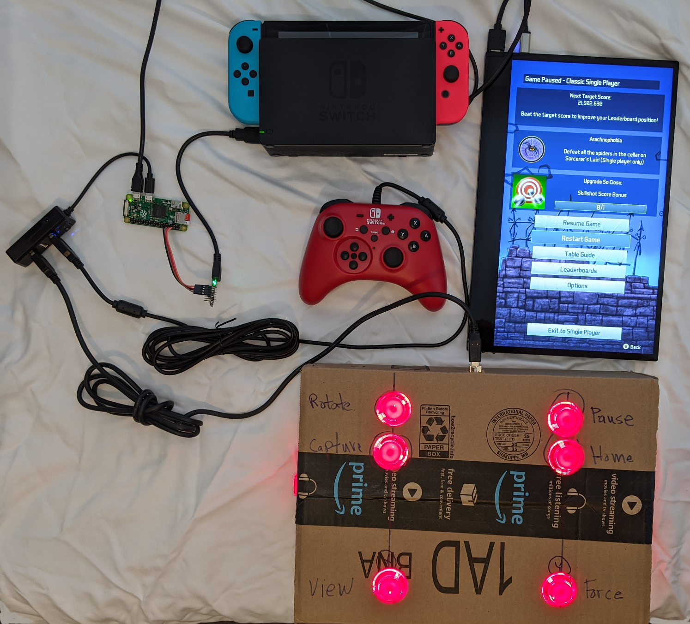

# Raspberry Pi Impersonates Nintendo Switch Controller

Adapt various USB gamepads, flight control sticks, and fight sticks for use
with the Nintendo Switch (NS) console. All controllers are active but are seen
by the console as one controller so co-pilot mode is always active.

```
                  Buttons
                     |
                     v
USB Controllers -> Raspberry Pi -> NSGadget -> Nintendo Switch
                     ^
                     |
                  Buttons
```

See [README_pinball.md](./README_pinball.md) for more details on this test configuration.



## USB Controllers

The following USB controllers are supported. The drivers are all included so
nothing needs to be installed.

* Hori HoriPad Nintendo Switch compatible gamepad
* Microsoft Xbox One gamepad
* Sony PS4 DS gamepad
* Logitech Extreme 3D Pro flight control stick
* Thrustmaster T.16000M flight control stick
* Dragon Rise arcade fight stick/joystick

jstest-gtk is a very handy utility to understand controller axes and buttons
numbering. This is essential to map axes and buttons to the NS controller.

```
sudo apt install jstest-gtk
```

## USB NSGadget

NSGadget is an Adafruit Trinket M0 emulating an NS compatible gamepad. The UART
connection between the Pi and NSGadget runs at 2 Mbits/sec. The UART device
name is /dev/ttyAMA0.

|Trinket M0 |Raspberry Pi
|-----------|------------
|BAT        |5V0
|Gnd        |Gnd
|TX(4)      |D14(RXD)
|RX(3)      |D15(TXD)

The firmware/ directory has the firmware.

Compiled programs can be burned into the Trinket M0 just by dragging and
dropping a UF2 file on to the Trinket M0 USB drive. There is no need to install
the Arduino IDE, source code, or USB serial device driver.

* Download the UF2 file of your choice.
* Plug in the Trinket M0 to the computer.
* Double tap the Trinket M0 reset button.
* When the TRINKETBOOT USB drive appears, drop the UF2 file on to the drive.
* Wait a few seconds until the Trinket M0 reboots.

## Prepare the Pi

Install Raspbian Buster Lite or Desktop. Update to the latest version.

```
sudo apt update
sudo apt full-upgrade
sudo reboot
```

### Prepare /dev/ttyAMA0

If the Pi has built-in bluetooth (Pi 3, Pi 3+, Pi 4, Pi zero W) disable
Bluetooth to free up the PL011 UART.

The following is from /boot/overlays/README.

```
Name:   disable-bt
Info:   Disable onboard Bluetooth on Pi 3B, 3B+, 3A+, 4B and Zero W, restoring
        UART0/ttyAMA0 over GPIOs 14 & 15.
        N.B. To disable the systemd service that initialises the modem so it
        doesn't use the UART, use 'sudo systemctl disable hciuart'.
Load:   dtoverlay=disable-bt
```

```
sudo systemctl disable hciuart
sudo nano /boot/config.txt
```
Add `dtoverlay=disable-bt` as the last line of config.txt. Save and exit.

Turn off the login shell on /dev/ttyAMA0. This is necessary even if the Pi does
not have Bluetooth.

```
sudo raspi-config
```

* Select `Interfacing Options`.
* Select `P6 Serial`.
* Disable the login shell.
* Enable the serial interface.
* Exit raspi-config

```
sudo reboot
```

## Buttons and GPIO

The Nintendo Switch gamepad has 18 buttons, 9 on each side.

Eighteen Raspberry Pi GPIOs pins are ready for buttons. The buttons must be
be normally open. When closed/pressed, the buttons must connect to ground.
Connecting buttons to GPIO pins is optional.

Map Raspberry Pi 2x20 pins to NS buttons.

|NS Button      |BCM Description    |Connector Pin  |Connector Pin  |BCM Description    |NS Button      |
|---------------|-------------------|---------------|---------------|-------------------|---------------|
|               |3V3                |              1|              2|5V0                |               |
|               |D2(SDA)            |              3|              4|5V0                |               |
|               |D3(SCL)            |              5|              6|Gnd                |               |
|Left throttle  |D4(GPCLK0)         |              7|              8|D14(TXD)           |               |
|               |Gnd                |              9|             10|D15(RXD)           |               |
|Left trigger   |D17                |             11|             12|D18(PWM0)          |               |
|Minus(-)       |D27                |             13|             14|Gnd                |               |
|Capture        |D22                |             15|             16|D23                |Right throttle |
|               |3V3                |             17|             18|D24                |Right trigger  |
|               |D10(MOSI)          |             19|             20|Gnd                |               |
|               |D9(MISO)           |             21|             22|D25                |Plus(+)        |
|               |D11(SCLK)          |             23|             24|D8(CE0)            |Home           |
|               |Gnd                |             25|             26|D7(CE1)            |A              |
|               |D0(ID_SD)          |             27|             28|D1(ID_SC)          |               |
|DPad Up        |D5                 |             29|             30|Gnd                |               |
|DPad Right     |D6                 |             31|             32|D12(PWM0)          |B              |
|DPad Down      |D13(PWM1)          |             33|             34|Gnd                |               |
|DPad Left      |D19(MISO_1)        |             35|             36|D16                |X              |
|Left stick     |D26                |             37|             38|D20(MOSI_1)        |Y              |
|               |Gnd                |             39|             40|D21(SCLK_1)        |Right stick    |

Note: The NS left and right thumbsticks are also buttons hence D26 and D21.

## Software

The Python3 program nsac.py holds all the parts together. Once it opens the
UART, it spins up a thread for each USB controller and a thread to monitor the
buttons connected to GPIO pins.

```
sudo apt install python3 python3-pip python3-serial python3-gpiozero
git clone https://github.com/gdsports/NSGadget_Pi
cd NSGadget_Pi
./nsac.py
```

nsgpadserial.py provides an interface to the NS Gadget device.

## Appliance Mode

If you do not want to login to run nsac.py and are not interested in changing
it, try appliance mode. In appliance mode, nsac.py runs on power up. Also the
filesystem is set for read-only mode so powering off without shutting down
should not corrupt the microSD card.

### Automatically run nsac.py

```
crontab -e
```

Add the following line to the end of the file. The small shell script starts
nsac.py at power/restart in a loop (just in case it crashes).

```
@reboot              nohup /home/pi/NSGadget_Pi/nsac.sh >/dev/null 2>&1 &
```

### Enable read-only file system to prevent microSD card corruption

```
sudo raspi-config
```

* Select `7 Advanced Options`.
* Select `AB Overlay FS` to enable overlay file system (read-only) and write-protect boot partition.
* Exit and reboot

