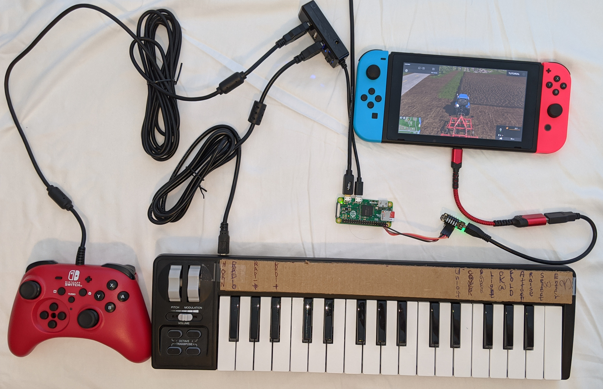

# Farming Simulator Controller From A MIDI Keyboard



"Farming Simulator Nintendo Switch Edition" is a port of Farming Simulator (FS)
to the Nintendo Switch (NS). The game is great fun but the numerous gamepad
button combinations are hard to remember. Two and three button combinations
(for example, L + R + Up) may be impossible for users with disabilities.

Logitech makes a steering wheel, pedals, and control panel bundle for FS but it
works only on Windows. I do not know if the Logitech bundle works on a Pi. If
it appears as a USB joystick, NSGadget should be able to use it like any other
joystick but code must be written for it.

Some Windows FS players use DIY button boxes AKA control panels to make it
easier to play. For example, see [Youtube video for DIY control box](https://www.youtube.com/watch?v=Z7Sc4MJ8RPM).
The DIY device will not work plugged into the NS but should work with NSGadget
since it is just another type of USB joystick. Code modifications will be
required.

I have toggle switches and large buttons but I have no time to build my dream
FS control panel. After scanning around for any USB device with big
buttons, I found my MIDI keyboard. No modifications to the keyboard are
required. Python can read MIDI Note On and Note Off events while ignoring velocity.
See the code at the end. The full code is in nsfs17.py

A MIDI controller with buttons that send CC messages may also work with
modifications to the Python code.

Another option is to use the buttons on large joysticks such as Thrustmaster or
Logitech. But I would love to see jaws dropping when someone plays FS with a
MIDI keyboard.

Yet another option is to use the Dragon Rise arcade buttons and USB encoder.
The code below that sends NS button combinations could adapted for USB
joysticks.

## Hardware

The MIDI keyboard pictured here is an AKM320 but any MIDI keyboard should work.

## Software

nsfs17.py is based on nsac.py but code has been added to support reading MIDI
events and writing NS button combinations.

```
def read_midi_notes(midi_input_name, first_note):
    """
    Read MIDI note on/off and generate NS gamepad events for Farming Simulator
    first_note -- First/lowest MIDI note number on keyboard
    """
    NOTE_MAP = [
        # Honk horn
        {'buttons': [NSButton.RIGHT_TRIGGER, NSButton.B]},    # Note On 53
        # Radio on/off
        {'buttons': [NSButton.LEFT_TRIGGER, NSButton.RIGHT_TRIGGER], 'dpad': NSDPad.UP},    # Note On 54
        0,                  # Note On 55
        # Radio prev station/if radio off, left turn signal
        {'buttons': [NSButton.LEFT_TRIGGER, NSButton.RIGHT_TRIGGER], 'dpad': NSDPad.LEFT}, # Note On 56
        0,                  # Note On 57
        # Radio nextious station/if radio off, right turn signal
        {'buttons': [NSButton.LEFT_TRIGGER, NSButton.RIGHT_TRIGGER], 'dpad': NSDPad.RIGHT},  # Note On 58
        0,                  # Note On 59
        0,                  # Note On 60
        0,                  # Note On 61
        0,                  # Note On 62
        0,                  # Note On 63
        0,                  # Note On 64
        0,                  # Note On 65
        0,                  # Note On 66
        0,                  # Note On 67
        0,                  # Note On 68
        0,                  # Note On 69
        0,                  # Note On 70
        0,                  # Note On 71
        0,                  # Note On 72
        0,                  # Note On 73
        0,                  # Note On 74
        # Unload
        {'buttons': [NSButton.RIGHT_TRIGGER, NSButton.X]},   # Note On 75
        # Open cover
        {'buttons': [NSButton.LEFT_TRIGGER], 'dpad': NSDPad.LEFT},   # Note On 76
        # Tool on/off
        {'buttons': [NSButton.LEFT_TRIGGER, NSButton.Y]},   # Note On 77
        # Head lights
        {'buttons': [NSButton.RIGHT_TRIGGER, NSButton.A]},  # Note On 78
        # OK, next
        {'buttons': [NSButton.A]},  # Note On 79
        # Fold/unfold tool
        {'buttons': [NSButton.LEFT_TRIGGER, NSButton.B]},   # Note On 80
        # Jump, attach/detach tool
        {'buttons': [NSButton.B]},  # Note On 81
        # Raise/lower tool
        {'buttons': [NSButton.LEFT_TRIGGER, NSButton.A]},   # Note On 82
        # Crouch, select tool
        {'buttons': [NSButton.X]},  # Note On 83
        # Enter/exit
        {'buttons': [NSButton.Y]},  # Note On 84
    ]

    with mido.open_input(midi_input_name) as inport:
        for msg in inport:
            if msg.type == 'note_on':
                index = msg.note - first_note
                if index >= 0 and NOTE_MAP[index]:
                    controls = NOTE_MAP[index]
                    if 'buttons' in controls:
                        for btn in controls['buttons']:
                            NSG.press(btn)
                    if 'dpad' in controls:
                        NSG.dPad(controls['dpad'])
            elif msg.type == 'note_off':
                index = msg.note - first_note
                if index >= 0 and NOTE_MAP[index]:
                    controls = NOTE_MAP[index]
                    # Release controls in reverse order
                    if 'dpad' in controls:
                        NSG.dPad(NSDPad.CENTERED)
                    if 'buttons' in controls:
                        for btn in reversed(controls['buttons']):
                            NSG.release(btn)

```
