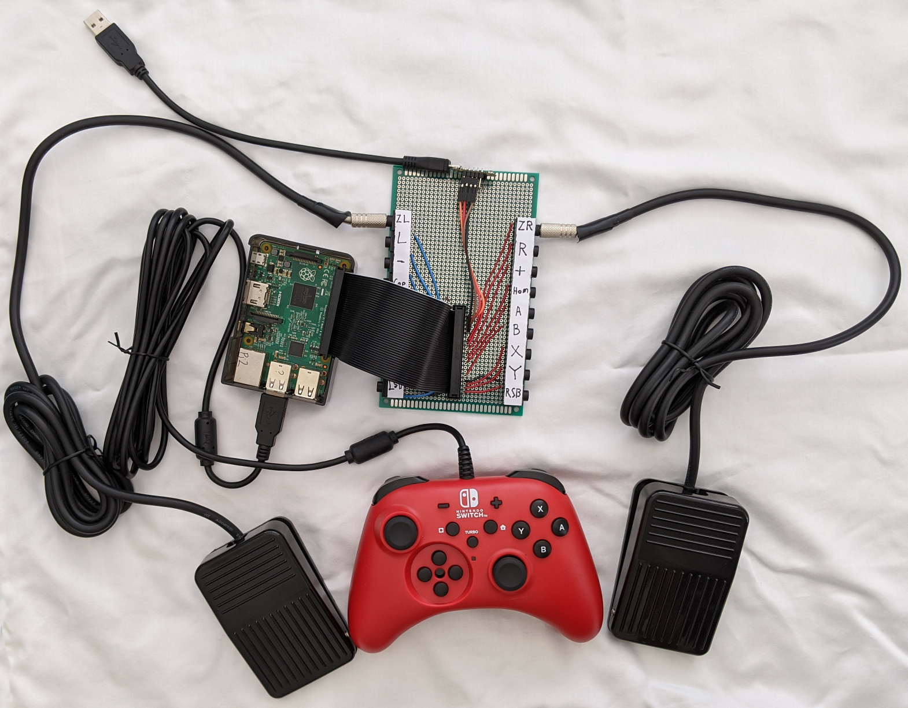

# GPIO Break Out Board

The Nintendo Switch gamepad has 18 buttons, 9 on each side. The GPIO break out
board has nine 3.5mm stereo jacks per side. Each jack corresponds to one
Nintendo Switch button.

Eighteen Raspberry Pi GPIOs pins are ready for buttons. The buttons must be
be normally open. When closed/pressed, the buttons must connect to ground.
Connecting buttons to GPIO pins is optional.

Map Raspberry Pi 2x20 pins to NS buttons.

|NS Button      |BCM Description    |Connector Pin  |Connector Pin  |BCM Description    |NS Button      |
|---------------|-------------------|---------------|---------------|-------------------|---------------|
|               |3V3                |              1|              2|5V0                |               |
|               |D2(SDA)            |              3|              4|5V0                |               |
|               |D3(SCL)            |              5|              6|Gnd                |               |
|Left throttle  |D4(GPCLK0)         |              7|              8|D14(TXD)           |               |
|               |Gnd                |              9|             10|D15(RXD)           |               |
|Left trigger   |D17                |             11|             12|D18(PWM0)          |               |
|Minus(-)       |D27                |             13|             14|Gnd                |               |
|Capture        |D22                |             15|             16|D23                |Right throttle |
|               |3V3                |             17|             18|D24                |Right trigger  |
|               |D10(MOSI)          |             19|             20|Gnd                |               |
|               |D9(MISO)           |             21|             22|D25                |Plus(+)        |
|               |D11(SCLK)          |             23|             24|D8(CE0)            |Home           |
|               |Gnd                |             25|             26|D7(CE1)            |A              |
|               |D0(ID_SD)          |             27|             28|D1(ID_SC)          |               |
|DPad Up        |D5                 |             29|             30|Gnd                |               |
|DPad Right     |D6                 |             31|             32|D12(PWM0)          |B              |
|DPad Down      |D13(PWM1)          |             33|             34|Gnd                |               |
|DPad Left      |D19(MISO_1)        |             35|             36|D16                |X              |
|Left stick     |D26                |             37|             38|D20(MOSI_1)        |Y              |
|               |Gnd                |             39|             40|D21(SCLK_1)        |Right stick    |

Note: The NS left and right thumbsticks are also buttons hence D26 and D21.

|Abbreviations  |Button Function
|---------------|---------------
|ZL             |Left throttle
|L              |Left trigger
|ZR             |Right throttle
|R              |Right trigger
|LSB            |Left thumbstick button
|RSB            |Right thumbstick button
